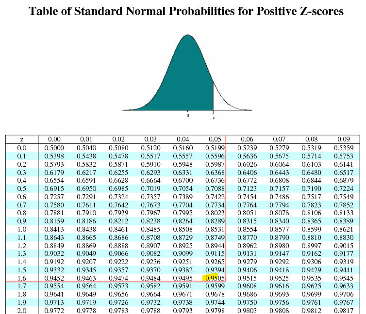
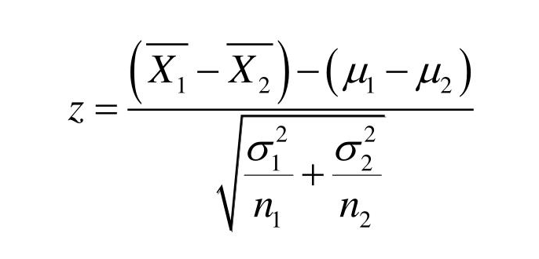

# 'A/B' quality test or Z-test for the mean of a distribution

Some company would like to compare quality of service for call center workers in two different locations A and B. The service quality will be estimated as a quantity of solves issues during a day. The company randomly select 30 workers from call center A and 30 from B. So, average completed issues in A was 750 with standard deviation 20. And average completed issues in B was 780 with standard deviation 25.

_Requirement to estimate_: Is the call center B shows statistically significant better service quality at statistical significance level 5%?

We will use Z-test ([Wikipedia](https://en.wikipedia.org/wiki/Z-test)) to compare two average of samples. The standard deviation is known and we assume samples with Normal distribution. Note: Z-test is valid for sample size from 30. Use Student's t-test instead for smaller sample sizes.

Null hypothesis H0 - mean of A is equals to the mean of B. Call center A shows the same service quality as the call center B.

Alternative hypothesis H1 - mean of A is NOT equals to the mean of B. Call center A service quality is different from the call center B quality.

Our hypotheses:
```
H0: ma == mb
H1: ma != mb
Z_critical(0.95) = 1.645
```

The H0 will be accepted if `|Z_value| < Z_critical` at statistical significance level 0.05.

Critical values of Z at given significance level `(1 - 0.05 = 0.95)` could be found from the such table below with Z-scores:



or could be calculated using python/scipy:

```python
import scipy
scipy.stats.norm.ppf(1-.05,loc=0,scale=1)
```
Output: 1.6448536269514722

Z-test formula:



Calculation of `z-value` using python:
```python
import math

ma = 750  # mean of A
mb = 780  # mean of B
sta = 20  # stdev of A
stb = 25  # stdev of B
numb = 30  # sample size

z_value = (mb - ma) / math.sqrt(sta**2 / numb + stb*2 / numb)
print(z_value)
```

Output: 5.1323935366098095

As we could see `5.132 > 1.645` or `Z_value > Z_critical`.

=> Hypothesis `H0: ma == mb` rejected. 

Hypothesis `H1: mb > ma` accepted with significance level 5%.

**Conclusion: The call center B shows better service quality than A.**

The same calculations could be done using Maxima:
```maxima
(%i5) f(ma, mb, sta, stb, num):=abs(ma - mb)/sqrt(sta^2/num + stb^2/num);

                                               abs(ma - mb)
(%o5)            f(ma, mb, sta, stb, num) := -----------------
                                                     2      2
                                                  sta    stb
                                             sqrt(---- + ----)
                                                  num    num

(%i7) f(750, 780, 20, 25, 30),numer;
(%o7)                          5.13239353660981
```


Calculation with mean and variance using Maxima:
```maxima
# var - Population variance with n denominator
# var1 - Sample variance with n-1 denominator

load ("descriptive")$
f(mean(x), mean(y), var1(x), var1(y), length(x));
```


