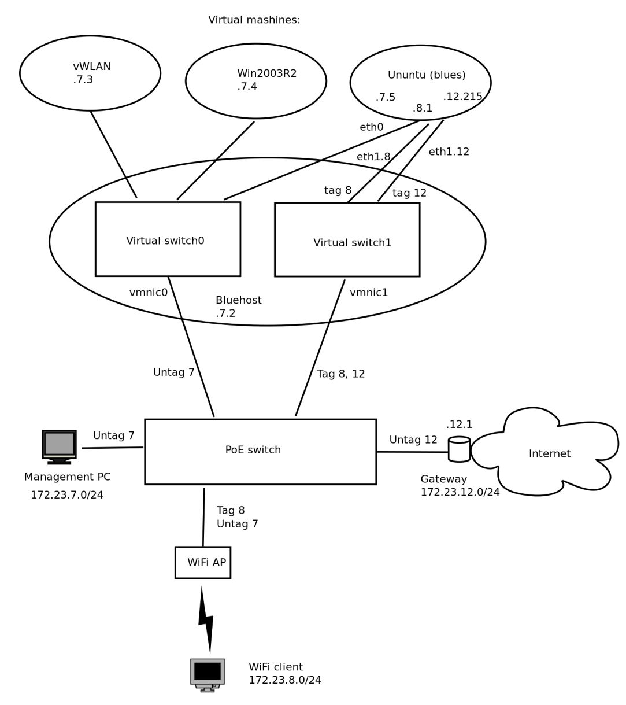
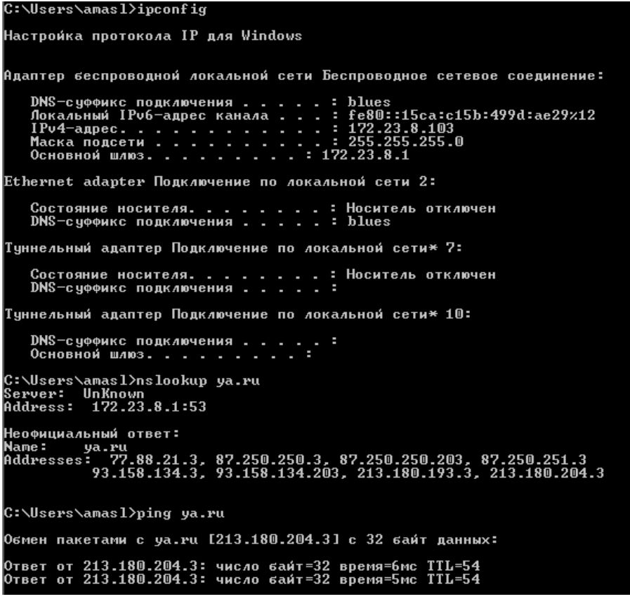

# Software server system "Bluehost"

The system based on x86 server running VMWare EXSi hypervisor with VMs: WiFi access points controller Bluesocket vWLAN, positioning WiFi system  Ekahau and Linux–router/RADIUS-server for Internet access control.

The server has 2 separate Ethernet interfaces for management and data networks connected to L2 switch. L2 switch used to provide connection to WiFi Access Points with PoE.

Network topology:


## Server "Bluehost"

- VLAN 7 - management
- VLAN 12 - Internet Access
- VLAN 8 - WiFi AP connection to Linux-router

2 VMWare virtual switches:

- switch0 - management (untaged VLAN 7)
- switch1 - VLAN tags 8, 12

WiFi clients authorized through management network (172.23.7.0/24) on vWLAN controller using RADIUS-server. In case of successful authorization the client is assigned IP-address inside VLAN 8 (network 172.23.8.0/24) and routed to Internet over VLAN 12 (network 172.23.12.0/24).

Network connection scheme:



Management PC has dedicated port on L2 switch to connect 172.23.7.0/24 network (untaged VLAN 7) to control all services.

## VMWare ESXi

3 virtual machines running on VMWare ESXi 5.0 server:

1) Ubuntu server "Blues" with services: DHCP, DNS (bind), RADIUS(freeradius), NTP, Firewall/NAT (netfilter);
2) Server Bluesocket (vWLAN controller);
3) Windows Server 2003R2 (Positioning system for WiFi).

Virtual switch connection scheme VMware ESXi vSwitch:


## Router "blues" (Ubuntu 12 Server) 

Network interfaces settings `/etc/network/interfaces`:
```
auto lo
iface lo inet loopback

# VLAN id 12 − Internet connection
auto eth1.12
	iface eth1.12 inet static
	address 172.23.12.215
	netmask 255.255.255.0
	broadcast 172.23.12.255
	gateway 172.23.12.1
	dns−nameservers 172.23.10.253
	vlan_raw_device eth1

# VLAN id 8 − WiFi clients connection
auto eth1.8
	iface eth1.8 inet static
	address 172.23.8.1
	netmask 255.255.255.0
	broadcast 172.23.8.255
	gateway 172.23.8.1
	dns−nameservers 172.23.10.253
	vlan_raw_device eth1

# Management network
auto eth0
iface eth0 inet static
	address 172.23.7.5
	netmask 255.255.255.0
	broadcst 172.23.7.255
	gateway 172.23.7.1
	dns−nameservers 172.23.10.253
	up route add −net 172.23.11.0/24 gw 172.23.7.1 dev eth0
```

Default route (routes.sh):

```bash
#!/bin/sh −e
if [ "$IFACE" = "eth0" ] ; then
	route del default gw 172.23.7.1
	route add default gw 172.23.12.1 dev eth1.12
fi

exit 0
```

DHCP server configuration (dhcpd.conf):

```
ddns−update−style none;

option domain−name "blues" ;
option vwlan code 43 = string;

default−lease−time 600;
max−lease−time 7200;
authoritative;
log−facility local7;

# Connecting WiFi BS
subnet 172.23.7.0 netmask 255.255.255.0 {
	interface eth0 ;
	option routers 172.23.7.1;
	option subnet−mask 255.255.255.0;
	option domain−name−servers 172.23.7.5, 172.23.10.253;
	option broadcast−address 172.23.7.255;
	option ntp−servers 172.23.7.5;
	default−lease−time 1209600;
	max−lease−time 2419200;
	option vwlan "172.23.7.3" ;
	range 172.23.7.100 172.23.7.150;
}

# Connecting WiFi clients
subnet 172.23.8.0 netmask 255.255.255.0 {
	interface eth1;
	option routers 172.23.8.1;
	option subnet−mask 255.255.255.0;
	option domain−name−servers 172.23.8.1, 172.23.10.253;
	option broadcast−address 172.23.8.255;
	option ntp−servers 172.23.8.1;
	default−lease−time 28800;
	max−lease−time 86400;
	range 172.23.8.100 172.23.8.250;
}
```

## Server vWLAN 

Network settings:


SSID settings:


Authentication settings for external RADIUS server:


Client connection from WiFi network:


