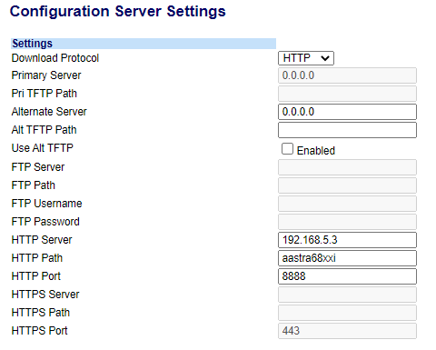
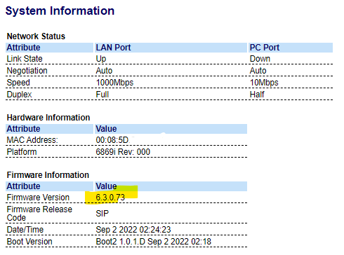
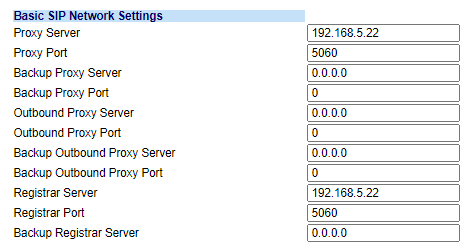
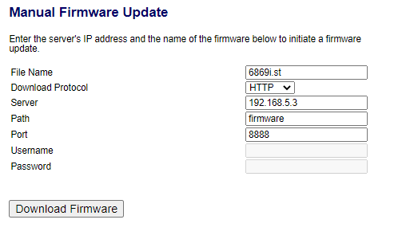

# Small HTTP server (Python/Flask) for uploading configuration and FW to Mitel SIP-phones

Create two local directories: `aastra68xxi` for configuration files and `firmware` for 6xxx.st FW and lang_xx.txt language files.

Create `startup.cfg` file in `aastra68xxi` folder:

```bash
$ cat aastra68xxi/startup.cfg
download protocol:HTTP
http server:192.168.5.3  #can be IP or FQDN
http path:aastra68xxi
http port:8888

firmware server: "http://192.168.5.3:8888/firmware"

sip transport protocol:1 #UDP(1),TCP(2),TLS(4)
sip srtp mode:0          #0(SRTP disabled),1(SRTP preferred),2(SRTP only)

sip line1 user name: EmergencyCallsOnly

sip proxy ip: 192.168.5.22
sip proxy port: 5060
sip registrar ip: 192.168.5.22
sip registrar port: 5060
```

Create `app.py` application script with http routes to these directories:

$ cat ./app.py

```python
import os
from flask import Flask
from flask import send_file

app = Flask(__name__)

@app.route("/")
def hello_test():
    return "Hello World!";

@app.route('/aastra68xxi/<path:filename>', methods=['GET'])
def download(filename):
    uploads = os.path.join("aastra68xxi", filename)
    return send_file(uploads)


@app.route('/firmware/<path:filename>', methods=['GET'])
def download_fw(filename):
    uploads = os.path.join("firmware", filename)
    return send_file(uploads)


if __name__ == "__main__":
    app.run(debug = False, host = "0.0.0.0", port = 8888)
```

Application script `app.py` should located in a root directory:

```bash
$ ls
aastra68xxi/  app.py  firmware/
```

Run Python/Flask application:

```bash
$ python3 ./app.py
 * Serving Flask app 'app'
 * Running on http://192.168.5.3:8888
Press CTRL+C to quit

192.168.5.11 - - [26/Jan/2023 20:10:30] "GET /aastra68xxi/startup.cfg HTTP/1.1" 200 -
192.168.5.11 - - [26/Jan/2023 20:10:42] "GET /firmware/6869i.st HTTP/1.1" 200 -
```

Test application by opening `http://192.168.5.3:8888/` in a browser.

Set Configuration Server on Mitel SIP-phone web GUI:



We could check new firmware version uploaded on System Info screen:



And SIP Network settings loaded from `startup.cfg`:



Alternatively you could run simple http server by typing python with command:

```bash
$ python3 -m http.server 8888
Serving HTTP on :: port 8888 (http://[::]:8888/) ...
::ffff:192.168.5.3 - - [26/Jan/2023 22:40:23] "GET / HTTP/1.1" 200 -
::ffff:192.168.5.3 - - [26/Jan/2023 22:40:28] "GET /aastra68xxi/ HTTP/1.1" 200 -
::ffff:192.168.5.3 - - [26/Jan/2023 22:40:36] "GET /firmware/ HTTP/1.1" 200 -
```

And set Manual Firmware Update:


